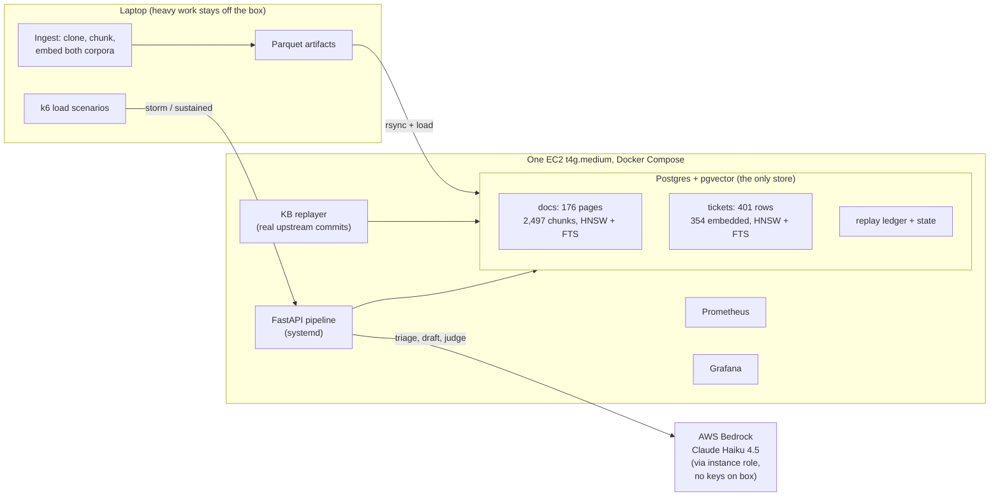
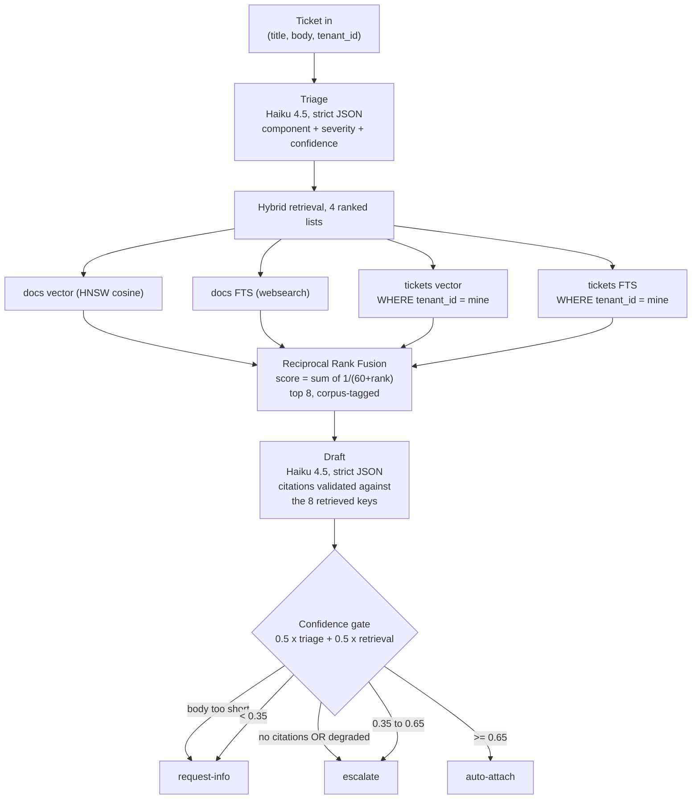
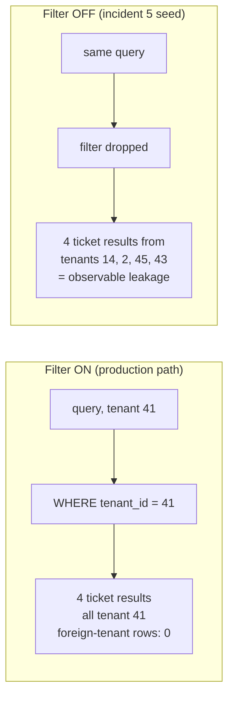
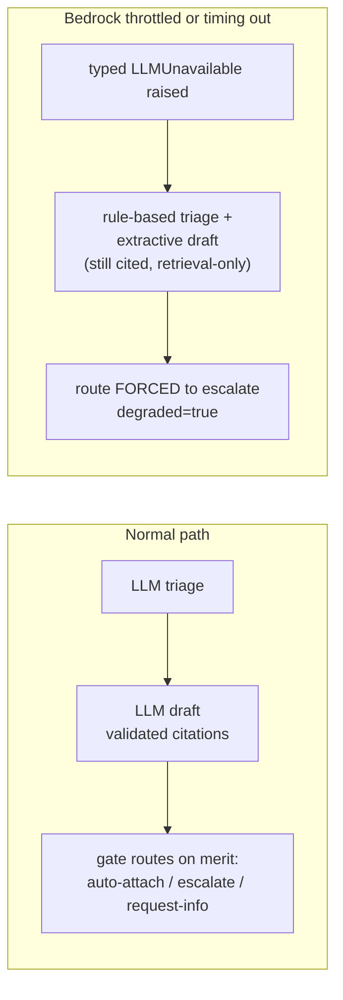
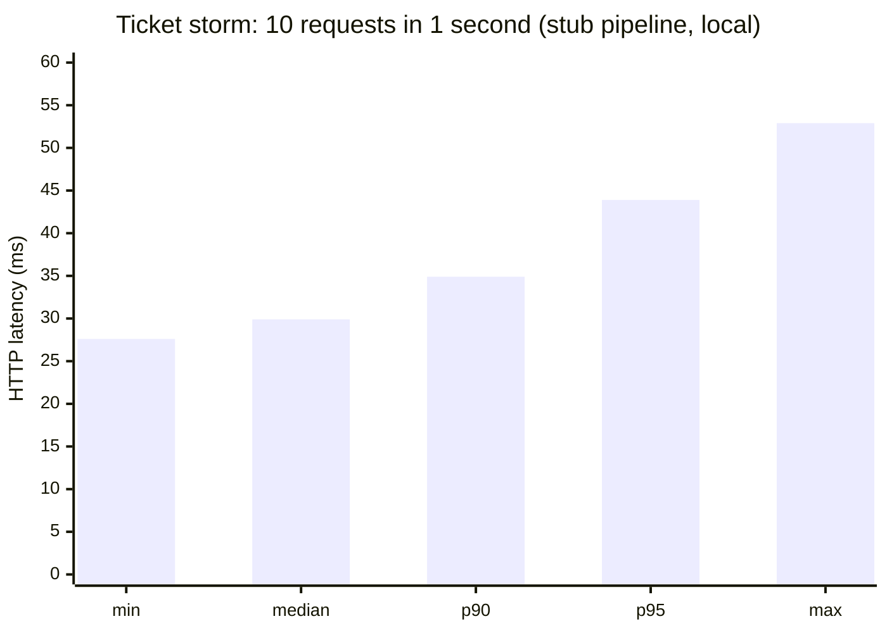
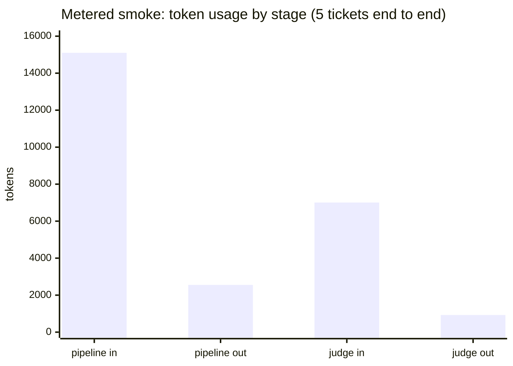
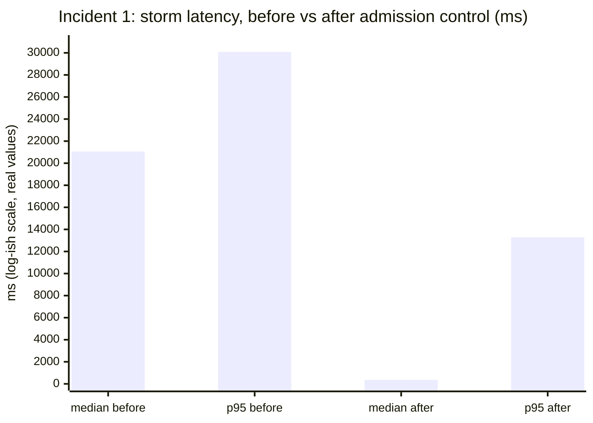
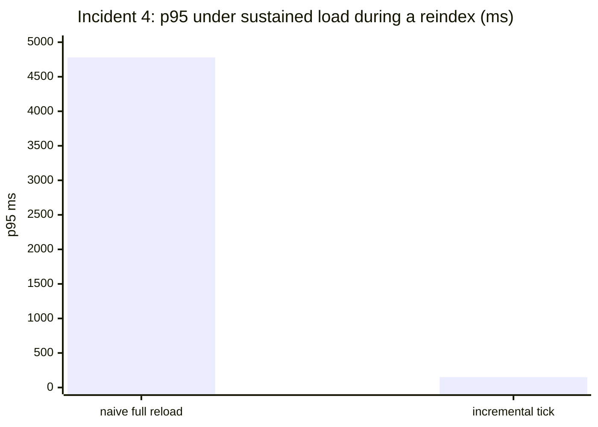

# rag-incident-lab

A deliberately small support-agent layer for a **hypothetical** managed-Kubernetes vendor, deployed on real AWS, then subjected to seven scripted production failures, each documented as a measured incident: detection metric, root cause, fix, before and after. Customers file failure tickets; the system attaches a drafted first response (probable cause, suggested fix, span citations, clarifying questions) behind a confidence gate that routes **auto-attach**, **escalate**, or **request-info**.

## Disclosures (binding on every published artifact from this repo)

1. **The vendor scenario is hypothetical.** "A managed-Kubernetes platform company with about 50 customers" does not exist; it is a framing device.
2. **All data is public Kubernetes project data**: [kubernetes/website](https://github.com/kubernetes/website) documentation as the knowledge base, [kubernetes/kubernetes](https://github.com/kubernetes/kubernetes) GitHub issues as the tickets, with SIG and kind labels as triage ground truth and linked closing PRs as fix ground truth.
3. **Only proxy metrics are claimed**: triage accuracy against real labels, fix-hit-rate against real resolutions, gate calibration, staleness and leakage measures. Business outcomes (first-response time, fix time, deflection rate) are never claimed because no humans are in the loop.
4. Numbers in this README are real, executed measurements from this system. Stub-path numbers are labeled as stub. Judged quality scores are withheld until a 30-ticket human spot-check of judge agreement is complete (see Evaluation discipline).

---

## The system in one picture



**Stack, pinned:** Python 3.12, FastAPI, Postgres 17 + pgvector 0.8.6 (the only datastore), fastembed bge-small-en-v1.5 (384-d, ONNX, CPU), Bedrock Converse with `us.anthropic.claude-haiku-4-5-20251001-v1:0`, Terraform, k6, Prometheus + Grafana. No orchestration frameworks, no managed vector services, no Kubernetes serving Kubernetes tickets, no autoscaling. One box.

---

## The data

| Corpus | Source | Size | Pinned at | Role |
|---|---|---|---|---|
| Knowledge base | kubernetes/website `content/en/docs/concepts` | 176 pages, 2,497 chunks | commit `7c54667` (2026-06-30) | Retrieval + replayed forward through real upstream commits |
| Resolved tickets | kubernetes/kubernetes closed `kind/bug` issues in sig/network, sig/scheduling, sig/storage | 401 issues, 392 with linked closing PR | snapshot 2026-08-19 | 354 as retrieval corpus, 47 held out as replayed incoming tickets |
| Tenancy | deterministic hash of issue number | 50 tenants, 3 to 15 tickets each | | Simulated customers; isolation enforced at retrieval |

The docs pin is deliberately backdated: 13 real upstream commits exist between the pin and upstream HEAD, so knowledge-base staleness is replayable history, not simulation.

Held-out tickets carry **NULL embeddings** in the database. Vector search structurally cannot return them; the `is_held_out` flag on the FTS path is defense in depth, not the only barrier.

---

## How a ticket flows



Worked example from a live run on the deployed box (ticket: "kube-proxy conntrack entries leak after LoadBalancer service deletion", tenant 41): triage matched 6 terms giving confidence 1.0; docs-vector rank 1 scored 1/61 = 0.0164; retrieval confidence 0.0164 / 0.0328 = 0.5; gate = 0.5 x 1.0 + 0.5 x 0.5 = **0.75, auto-attach**, 5 validated citations, retrieval in 75ms on the t4g.

The draft stage refuses to trust the model: any citation whose source key is not one of the 8 retrieved item keys fails validation, retries once, then degrades. Hallucinated sources are structurally excluded from the output.

---

## Failure management, measured before and after

### Tenant isolation (the mechanism incident 5 will break on purpose)

Per-tenant resolved tickets are private context. Isolation is a retrieval filter, and the system was built so that removing it is observable. Same query, same tenant, live system:



| | Filter ON | Filter OFF |
|---|---|---|
| Foreign-tenant rows in top 8 | **0** (verified per-row against the DB) | **4** (tenants 14, 2, 45, 43) |
| Decision point | logged at WARNING when disabled | same log line is the detection signal |

### Bedrock failure (incident 6's mechanism, verified by test against the real DB)



| Property under throttle | Verified outcome |
|---|---|
| Request fails | No: 200 with a full structured response |
| Draft still cites sources | Yes: extractive draft from retrieved items |
| Can a degraded draft auto-attach | **Never**: gate bypassed, escalate forced |
| Operator visibility | `degraded: true` + WARNING logs at both decision points |

### Knowledge-base drift (the engine for incidents 2 and 3)

The replayer applies real upstream commits one at a time: re-chunk and re-embed only the changed pages, delete or rename with a ledger entry, one transaction per commit so readers never see a half-updated page. Five commits replayed locally in order:

| Commit | Page | Change | Chunks before | Chunks after |
|---|---|---|---|---|
| `7d9cfb9` | storage/volumes.md | modified | 54 | 63 |
| `fd58845` | scheduling-eviction/node-pressure-eviction.md | modified | 37 | 38 |
| `ba32fca` | scheduling-eviction/node-pressure-eviction.md | modified | 38 | 38 |
| `787489f` | scheduling-eviction/topology-aware-… | modified | 4 | 4 |
| `04084d8` | services-networking/gateway.md | modified | 12 | 12 |

---

## Measured results so far

### Latency



| Measurement | Value | Conditions |
|---|---|---|
| Storm: 11 requests / 1s | 0 failures, median 30ms, p95 44ms | k6, stub pipeline, local (latency only; stub quality numbers are never reported) |
| Hybrid retrieval, warm | mean 8.7ms, p50 8.5ms over 20 calls | laptop, embed + 4 queries + fusion |
| Retrieval on the deployed box | 75ms | t4g.medium, live ticket |
| 8 concurrent retrievals | identical results, no errors | one connection per thread |

### Bedrock, metered (5 held-out tickets, full pipeline + judge)



| Metric | Measured |
|---|---|
| Pipeline calls (triage + draft, incl. 2 validation retries) | 12 calls, 15,099 in / 2,553 out tokens |
| Judge calls | 5 calls, 7,008 in / 926 out tokens |
| **Total cost, 5 tickets end to end** | **$0.0395** at first-party list rates ($1/$5 per MTok; Bedrock partner pricing may differ) |
| LLM triage vs real SIG labels | 5 of 5 correct (smoke-sized n; the full held-out run is the reportable number) |

### Retrieval findings already on the record

- **FTS contributes zero results for long queries**: a 9-word ticket title ANDs into nothing under `websearch_to_tsquery`, while a 3-word query returns full lists. Fusion on realistic tickets is vector-driven today; any FTS rewrite must justify itself on replay metrics, not vibes.
- **Gate calibration is the open weakness**: when FTS is empty, the retrieval-confidence term collapses to a constant 0.5, so routing is dominated by triage confidence. Quantifying the damage is exactly what the incident series is for.

---

## The seven incidents, measured

Each incident ran on the deployed system with one v1 fix, before and after. Scripted injections (the incident 3 deletion, the incident 6 throttle) are labeled scripted in the ledger and configuration; everything else is real load, real upstream commits, or the corpus's own properties. Raw data: [artifacts/incidents/](artifacts/incidents/).

| # | Incident | Before (failure) | After (v1 fix) |
|---|---|---|---|
| 1 | Ticket storm, LLM in request path | median **21.1s**, p95 30s, only 6 of 11 requests finished in 30s | admission control (cap 3, overflow degrades): median **365ms**, all 11 finish, 0 failures |
| 2 | Stale KB after real upstream edits | **8 of 8** changed-page queries served stale content | replay the real commits: **0 of 8** |
| 3 | Orphaned page (scripted deletion) | deleted ingress page still cited in top 5 | replayer delete, 27 chunks removed, ledger row; retrieval falls to live pages |
| 4 | Reindex under load | naive one-transaction reload: p95 **4,780ms**, 0.6% hard failures | incremental replay tick: p95 **150ms**, 0 failures |
| 5 | Tenant leakage (seeded filter bug) | **47 of 47** queries leak; 184 of 188 ticket results foreign | **0 of 47** with the filter restored |
| 6 | Provider throttle (scripted injection) | no degrade path: **15 of 15 requests fail** with 5xx | 15 of 15 return cited retrieval-only drafts, all force-escalated, median 285ms |
| 7 | Image-blind baseline vs captioning | text-only: same-SIG 87.5%, docs-domain 71.9% (n=32) | captioning (29 images, $0.04): **no improvement** (84.4% / 68.8%), an honest null result: near-ceiling metric, and long captions dilute short-title queries |





The incident 7 null result is kept deliberately: the series is about measurement discipline, and "the obvious fix did not move the metric" is a finding, not a failure of the writeup.

---

## Evaluation discipline

Two tiers, so evaluation cost stays sane:

| Tier | What runs | When |
|---|---|---|
| Retrieval-tier (no LLM) | corpus counts, filter binding, latency, staleness/orphan probes | continuously, free |
| LLM-tier | triage vs real labels, drafted responses judged against a **pinned rubric** ([probes/rubric.md](probes/rubric.md)), fix-hit vs real closing PRs | held-out slice + sampled schedules, metered |

Hard rules: stub outputs never produce published quality numbers; **no judged number is published before a 30-ticket human spot-check of judge agreement** (deterministic sample: [artifacts/spot_check_sampling_sheet.csv](artifacts/spot_check_sampling_sheet.csv)). The judge already runs; its scores stay unpublished until that sheet is filled. Honesty is the product here.

---

## Repo map

| Path | What lives there |
|---|---|
| [ingest/](ingest/) | docs clone (pinned SHA), Hugo-aware chunker, embeddings, Postgres loader |
| [tickets/](tickets/) | GitHub snapshot pull, deterministic tenancy + held-out split, loader |
| [retrieval/](retrieval/) | hybrid search: pgvector + FTS + RRF, tenant filter |
| [triage/](triage/) · [gate/](gate/) | rule stub + Haiku triage; the confidence gate (the only "agent" here) |
| [api/](api/) | FastAPI pipeline, Bedrock client, LLM draft with citation validation |
| [updater/](updater/) | KB commit replayer + ledger |
| [probes/](probes/) | replay harness, judge + pinned rubric, metered smoke, spot-check sheet |
| [load/](load/) | k6: storm, sustained, reindex-under-load |
| [infra/](infra/) | Terraform (t4g.medium, SG allowlist, Bedrock instance role), deploy/stop/residual scripts |
| [artifacts/](artifacts/) | committed measurements: k6 summaries, metered smoke JSON, corpus manifest counterparts |

## Quickstart

```sh
make setup          # uv sync: Python 3.12, pinned dependencies
cp .env.example .env
make db-up          # pgvector Postgres on 127.0.0.1:5433
make test           # 39 tests; DB-backed degradation test runs via --env-file
```

Corpus build: `uv run python -m ingest.build_docs_corpus`, then `uv run --env-file .env python -m ingest.load_docs` (tickets analogous under `tickets/`). API: `uv run --env-file .env uvicorn api.main:app --port 8080`. AWS: `terraform -chdir=infra apply`, `bash infra/deploy.sh`, and `infra/stop_instance.sh` + `infra/residual_check.sh` when done (the discipline is stop between sessions, residual-check every weekend).

## Relationship to airflow_sec_rag

This project complements airflow_sec_rag rather than repeating it. airflow_sec_rag proves offline correctness: span citations, refusal behavior, a fail-closed golden gate. rag-incident-lab proves runtime operations: burst load, knowledge-base freshness, deletion, write contention, tenant isolation, provider failure, measured on a live deployment. Together they cover a RAG-backed system offline and in production.

## Attribution

Kubernetes documentation content comes from [kubernetes/website](https://github.com/kubernetes/website), by The Kubernetes Authors, licensed under [CC BY 4.0](https://creativecommons.org/licenses/by/4.0/). Any published artifact from this repo that reproduces documentation content carries this attribution. GitHub issue content: every referenced ticket links to its source issue on kubernetes/kubernetes; quotes are minimal; full issues or comment threads are never reproduced; contributor quotes carry the issue link.
