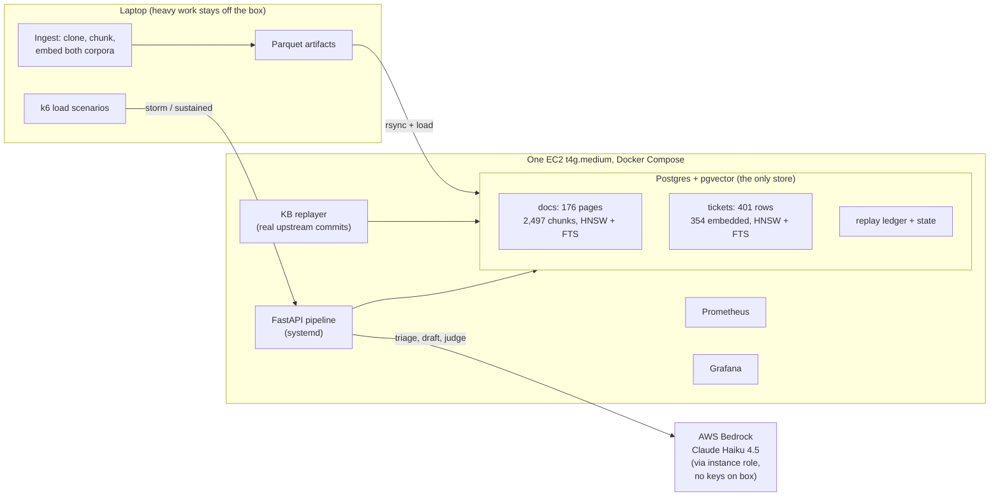
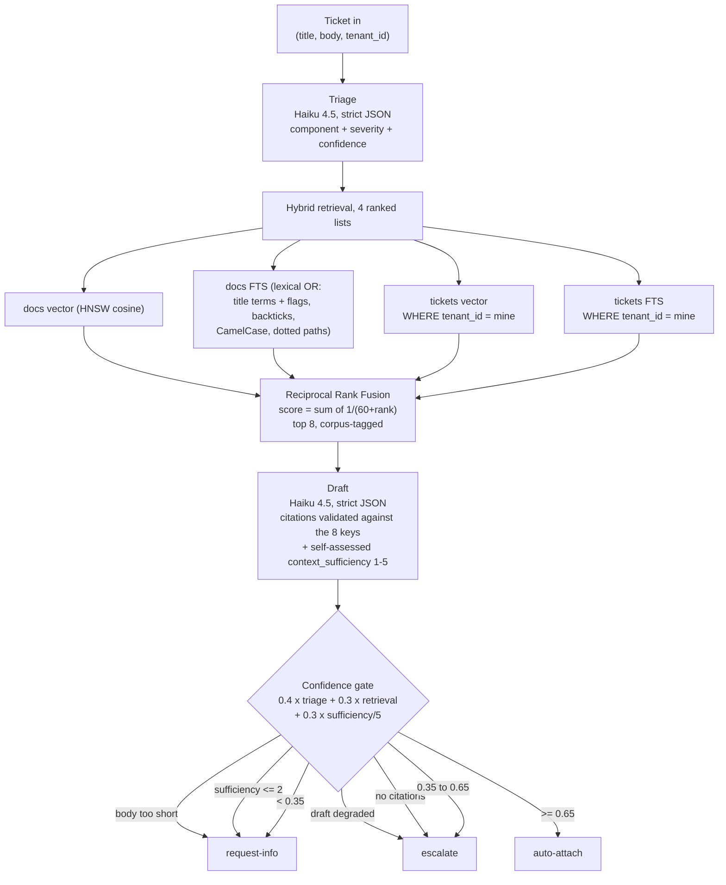
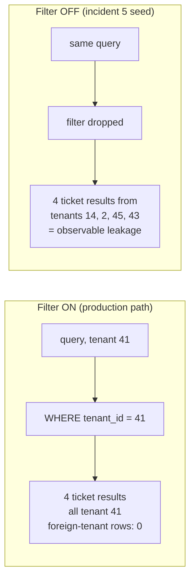
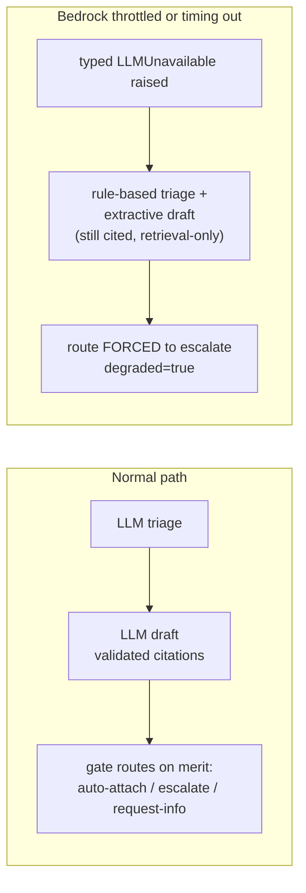
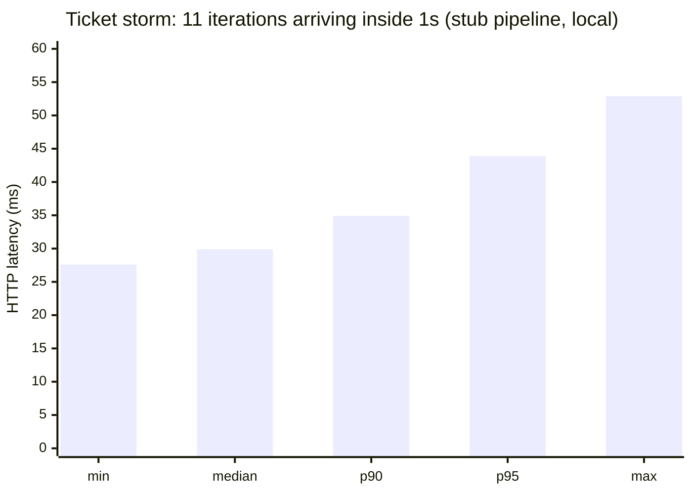
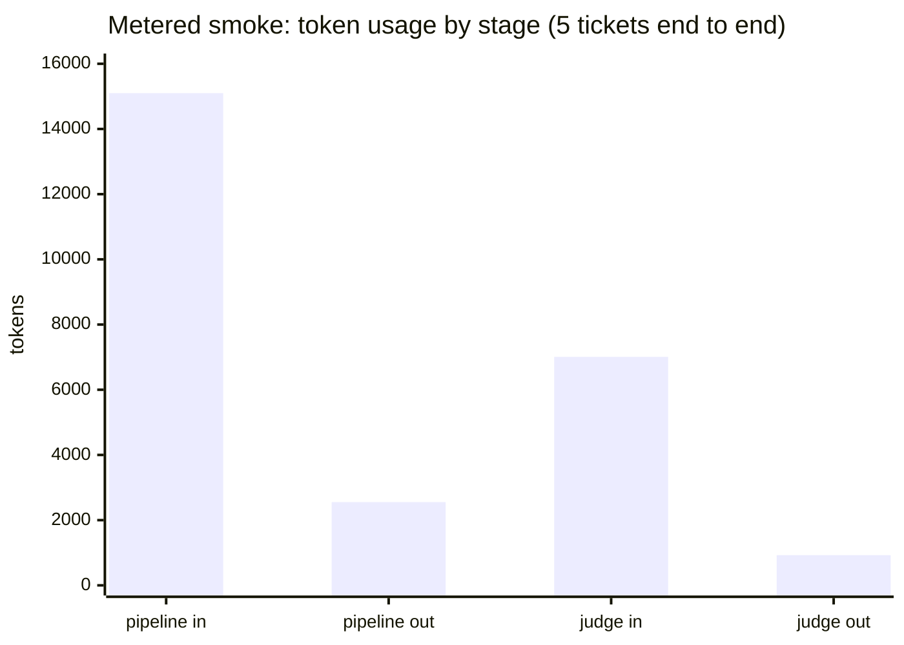
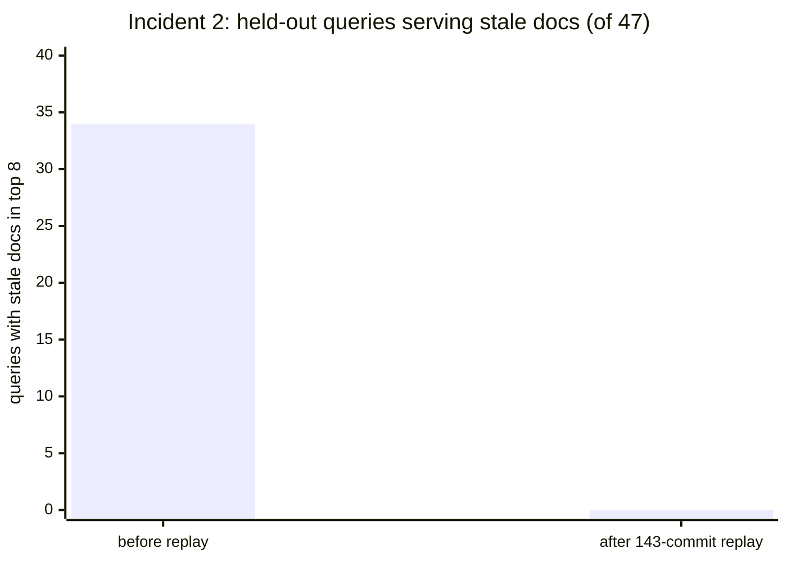
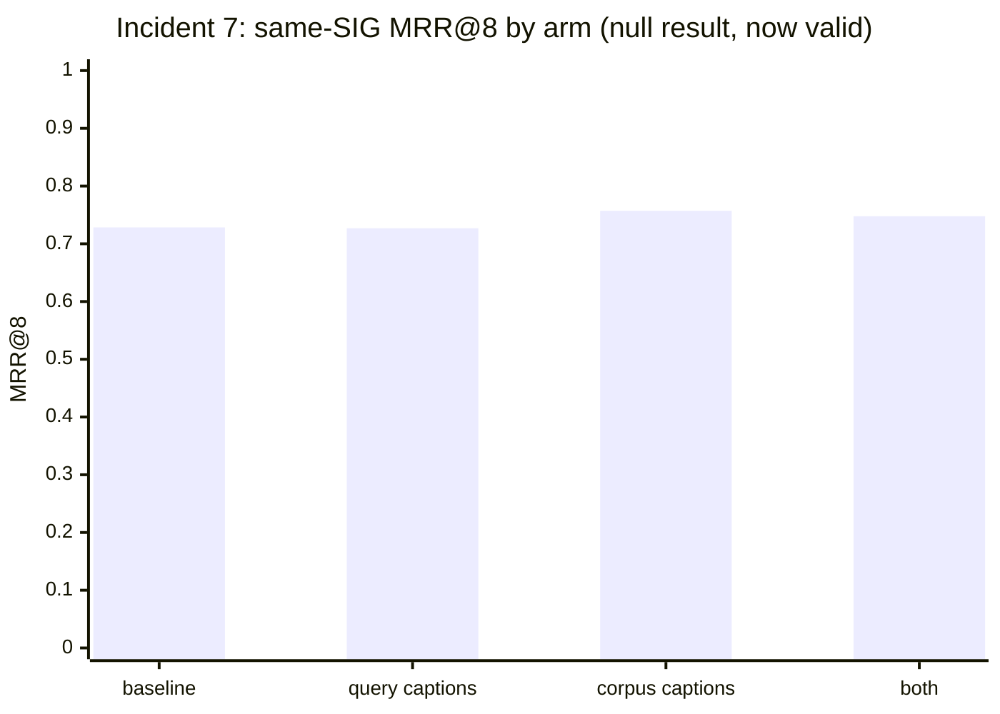
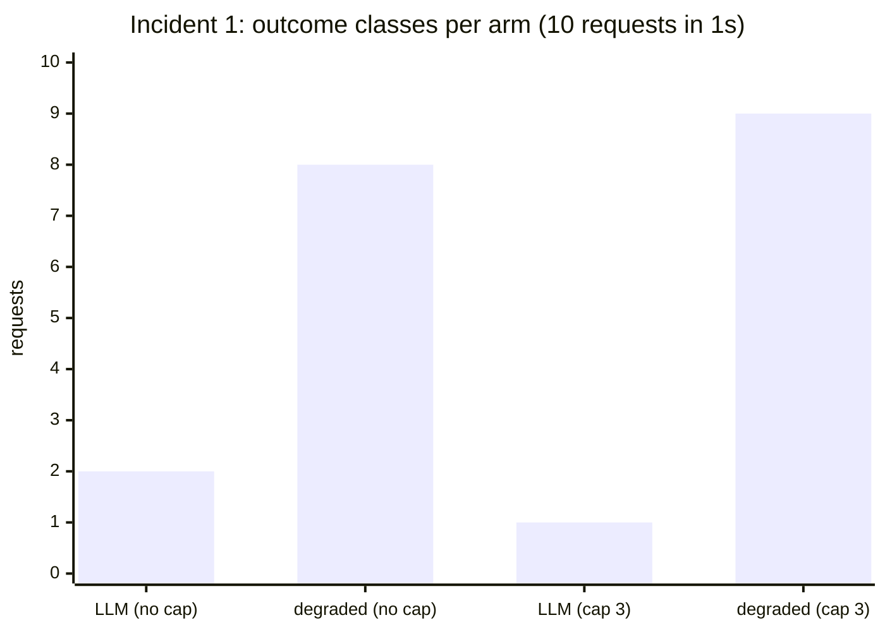
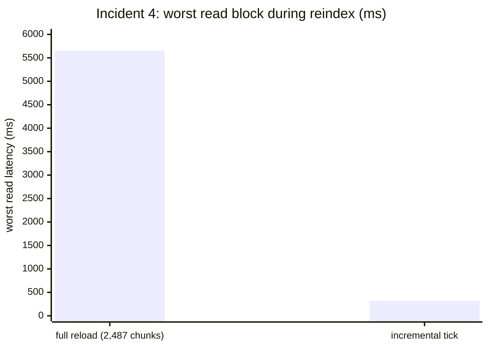

# rag-incident-lab

A deliberately small support-agent layer for a **hypothetical** managed-Kubernetes vendor, deployed on real AWS, then subjected to seven scripted production failures, each documented as a measured incident: detection metric, root cause, fix, before and after. Customers file failure tickets; the system attaches a drafted first response (probable cause, suggested fix, span citations, clarifying questions) behind a confidence gate that routes **auto-attach**, **escalate**, or **request-info**.

## Disclosures (binding on every published artifact from this repo)

1. **The vendor scenario is hypothetical.** "A managed-Kubernetes platform company with about 50 customers" does not exist; it is a framing device.
2. **All data is public Kubernetes project data**: [kubernetes/website](https://github.com/kubernetes/website) documentation as the knowledge base, [kubernetes/kubernetes](https://github.com/kubernetes/kubernetes) GitHub issues as the tickets, with SIG and kind labels as triage ground truth and linked closing PRs as fix ground truth.
3. **Only proxy metrics are claimed**: triage accuracy against real labels, fix-hit-rate against real resolutions, gate calibration, staleness and leakage measures. Business outcomes (first-response time, fix time, deflection rate) are never claimed because no humans are in the loop.
4. Numbers in this README are real, executed measurements from this system. Stub-path numbers are labeled as stub. Judged quality scores are withheld until a 30-ticket human spot-check of judge agreement is complete (see Evaluation discipline).

---

## The system in one picture



**Stack, pinned:** Python 3.12, FastAPI, Postgres 17 + pgvector 0.8.6 (the only datastore), fastembed bge-small-en-v1.5 (384-d, ONNX, CPU), Bedrock Converse with `us.anthropic.claude-haiku-4-5-20251001-v1:0`, Terraform, k6, Prometheus + Grafana. No orchestration frameworks, no managed vector services, no Kubernetes serving Kubernetes tickets, no autoscaling. One box.

---

## The data

| Corpus | Source | Size | Pinned at | Role |
|---|---|---|---|---|
| Knowledge base | kubernetes/website `content/en/docs/concepts` | 176 pages, 2,487 chunks | commit `7c54667` (2026-06-30) | Retrieval + replayed forward through real upstream commits |
| Resolved tickets | kubernetes/kubernetes closed `kind/bug` issues in sig/network, sig/scheduling, sig/storage | 401 issues, 392 with linked closing PR | snapshot 2026-08-19 | 354 as retrieval corpus, 47 held out as replayed incoming tickets |
| Tenancy | deterministic hash of issue number | 50 tenants, 3 to 15 tickets each | | Simulated customers; isolation enforced at retrieval |

The docs pin is deliberately backdated, so knowledge-base staleness is replayable history, not simulation: at the 2026-08-27 measurement snapshot, 143 real upstream commits touching the subtree existed between the pin and origin/main, and incident 2 replays all of them.

Held-out tickets carry **NULL embeddings** in the database. Vector search structurally cannot return them; the `is_held_out` flag on the FTS path is defense in depth, not the only barrier.

---

## How a ticket flows



Retrieval confidence is computed, never assumed: 0.5 x multi-list agreement in the top 8 + 0.3 x (FTS contributed at all) + 0.2 x score margin. An earlier version collapsed to a constant 0.5 whenever FTS returned nothing, which was always; that defect and its fix are measured below.

Worked example from a live run (held-out ticket [#137797](https://github.com/kubernetes/kubernetes/issues/137797), "CVE-2026-3864: CSI Driver for NFS path traversal", tenant 3): triage sig/storage at 0.98; retrieval confidence 0.81 (multi-list agreement + FTS + margin, computed); the draft self-assesses context_sufficiency **1**, because the concepts docs genuinely do not contain this CVE's remediation, and cites nothing. Gate: 0.4 x 0.98 + 0.3 x 0.81 + 0.3 x 0.2 = 0.695, but the sufficiency <= 2 hard rule fires first: **request-info**, with three concrete clarifying questions (deployed driver version, RBAC scope on PV creation, volumeHandle audit). Retrieval 73ms, full pipeline 5.4s. An earlier README version showed a "0.75 auto-attach with 5 validated citations" worked example here; the audit traced it to the degraded extractive path wearing the success path's clothes, and it is retracted (that failure is incident 8 material).

The draft stage refuses to trust the model: any citation whose source key is not one of the 8 retrieved item keys fails validation, retries once, then degrades. Hallucinated sources are structurally excluded from the output.

---

## Failure management, measured before and after

### Tenant isolation (the mechanism incident 5 will break on purpose)

Per-tenant resolved tickets are private context. Isolation is a retrieval filter, and the system was built so that removing it is observable. Same query, same tenant, live system:



| | Filter ON | Filter OFF |
|---|---|---|
| Foreign-tenant rows in top 8 | **0** (verified per-row against the DB) | **4** (tenants 14, 2, 45, 43) |
| Decision point | logged at WARNING when disabled | same log line is the detection signal |

Honesty note: with ~50 tenants sharing one corpus, a tenant-blind retriever is *expected* to return ~98% foreign rows (the null model predicts a 0.9801 foreign fraction; the filter-off arm observes 0.9786). The filter-off arm therefore demonstrates the isolation mechanism, it does not measure a detection capability, and the incident 5 row below is framed accordingly.

### Bedrock failure (incident 6's mechanism, verified by test against the real DB)



| Property under throttle | Verified outcome |
|---|---|
| Request fails | No: 200 with a full structured response |
| Draft still cites sources | Yes: extractive draft from retrieved items |
| Can a degraded draft auto-attach | **Never**: gate bypassed, escalate forced |
| Operator visibility | `degraded: true` + WARNING logs at both decision points |

### Knowledge-base drift (the engine for incidents 2 and 3)

The replayer applies real upstream commits one at a time: re-chunk and re-embed only the changed pages, delete or rename with a ledger entry, one transaction per commit so readers never see a half-updated page. The "one transaction per commit" claim was initially FALSE: an implicit transaction opened by the state read swallowed every per-commit transaction into one giant one, so 143 live-applied commits were invisible to other connections until the process exited and a crash would have rolled back all of them (audit A11). The fix commits after the state read; mid-replay ledger visibility from a second connection is now verified live, and the full 143-commit replay ends with all 38 upstream-modified pages byte-identical to a fresh chunking of origin/main. Five commits replayed locally in order:

| Commit | Page | Change | Chunks before | Chunks after |
|---|---|---|---|---|
| `7d9cfb9` | storage/volumes.md | modified | 54 | 63 |
| `fd58845` | scheduling-eviction/node-pressure-eviction.md | modified | 37 | 38 |
| `ba32fca` | scheduling-eviction/node-pressure-eviction.md | modified | 38 | 38 |
| `787489f` | scheduling-eviction/topology-aware-… | modified | 4 | 4 |
| `04084d8` | services-networking/gateway.md | modified | 12 | 12 |

---

## Measured results so far

### Latency



| Measurement | Value | Conditions |
|---|---|---|
| Storm: 11 requests / 1s | 0 failures, median 30ms, p95 44ms | k6, stub pipeline, local (latency only; stub quality numbers are never reported) |
| Hybrid retrieval, warm (post-FTS-rewrite) | mean 16.3ms, p50 15.9ms, p95 18.9ms over 20 calls | laptop, embed + 4 lists + fusion; the lexical OR query roughly doubles pre-rewrite cost (was mean 8.7ms) and buys the MRR gain above |
| Retrieval on the deployed box | 73ms | t4g.medium, live held-out ticket, post-rewrite |
| 8 concurrent retrievals | identical results, no errors | one connection per thread |

### Bedrock, metered (5 held-out tickets, full pipeline + judge)



| Metric | Measured (2026-08-27, post-audit rebuild) |
|---|---|
| Pipeline calls (triage + draft) | 10 calls = exactly 2 x 5 tickets, **zero validation retries**; 25,214 in / 2,363 out tokens |
| Judge calls | 5 calls, 9,597 in / 882 out tokens |
| **Total cost, 5 tickets end to end** | **$0.051** at first-party list rates ($1/$5 per MTok; Bedrock partner pricing may differ) |
| LLM triage vs real SIG labels | 5 of 5 correct (smoke-sized n; the full held-out run is the reportable number) |
| 30-ticket spot-check fill | 90 calls, 0/30 degraded, $0.30; every call metered, ledger reconciles |

An earlier version of this table reported $0.0395 with "2 validation retries" and a call ledger that did not reconcile (104 expected vs 100 recorded): the unmetered gap was botocore's hidden internal retries, which also sat inside the admission-control semaphore. Internal retries are now disabled (max_attempts=1) and the failure taxonomy is explicit, so every Bedrock attempt is one metered call.

### Held-out evaluation: the quality tier, measured (JUDGE-ONLY)

All 47 held-out tickets through the live pipeline ([artifacts/held_out_eval.json](artifacts/held_out_eval.json), $0.47 metered, 0/47 degraded):

| Metric | Value | Labeling |
|---|---|---|
| Triage accuracy | **44 of 47 (93.6%)** | proxy vs real maintainer SIG labels; no judge involved |
| Gate routes | 43 request-info, 4 auto-attach, 0 escalate | the drafts themselves report context_sufficiency 1 on 35, 2 on 8, 3 on 4 tickets: for most real bugs the concepts docs genuinely cannot contain the resolution, and the system now says so instead of attaching uncited advice |
| Draft grounding | median 5 (29 fives, 17 at 1-2) | JUDGE-ONLY: same-family judge, real closing-PR ground truth, cited spans in-prompt; human agreement pass waived 2026-08-27, no kappa claimed |
| Cause plausibility | median 4, **bimodal: 21 ones vs 20 fives** | the judge separates drafts whose hypothesis matches the actual merged fix from those that miss; JUDGE-ONLY |
| Actionability | median 3 (20 twos, 19 fours) | JUDGE-ONLY |

### Retrieval findings already on the record

- **Found, then fixed: FTS contributed zero results for every real query.** `websearch_to_tsquery` ANDs a ticket-length query into nothing; measured on the 15-query replay set, both FTS lists were empty 15/15, which also made RRF fusion inert (identical scores, lexicographic tie-break, docs always first). The fix OR-ifies title terms plus a lexical payload mined from the body (backticked terms, `--flags`, CamelCase, dotted.paths, quoted errors), pre-registered gates, A/B on the same DB state ([artifacts/r2_fts_ab.json](artifacts/r2_fts_ab.json)): docs-FTS non-empty 0/15 -> 15/15, multi-list membership in the top 8 0% -> 70%, docs-always-first 15/15 -> 1/15, MRR of the first same-SIG ticket **0.383 -> 0.787**, same-SIG@8 13 -> 14, docs-domain@8 10 -> 12 of 15.
- **Found, then fixed: the gate was blind.** Retrieval confidence was a constant 0.5 whenever FTS was empty (always), capping gate confidence at a ceiling that one audit could reproduce as an arithmetic identity across every artifact row, and drafts that openly declared their context insufficient were still auto-attached. The v2 gate computes retrieval confidence from list agreement, blends in the draft's own context_sufficiency, and hard-routes sufficiency <= 2 to request-info: on the 30-ticket spot-check rebuild, **zero** confident-but-uncited drafts were auto-attached (previously 15/15 auto-attaches carried a draft that said its own context was insufficient).
- **A bge query-prefix A/B came back null**: prepending the bge query instruction moved every replay metric by 0.0000, below the pre-registered 0.02 adoption bar, so the flag was deleted rather than shipped ([artifacts/r2_fts_ab.json](artifacts/r2_fts_ab.json)).

---

## The seven incidents, measured

Each incident runs with one v1 fix, before and after, against the naive baseline. Scripted injections are labeled scripted in the ledger and configuration; everything else is real load, real upstream commits, or the corpus's own properties. Every post-audit artifact embeds `run_meta` (git SHA, behavior env, DB fingerprint, run ordinal) and the set is machine-validated by [probes/check_artifacts.py](probes/check_artifacts.py). Raw data: [artifacts/incidents/](artifacts/incidents/).

**Re-measured after the audit** (single SHA, content-hash staleness, hybrid retrieval path, honest denominators):

| # | Incident | Before (failure) | After (v1 fix) |
|---|---|---|---|
| 2 | Stale KB after real upstream edits | **34 of 47** held-out queries served stale docs in their top 8 (72.3%); 37 of 38 upstream-modified pages truly content-changed (chunk-hash vs origin/main); 11 added + 1 deleted + 1 renamed page disclosed as unmeasurable by this metric | replay all 143 real commits: **0 of 47**, with all 38 modified pages verified chunk-identical to origin/main |
| 3 | Orphaned page (scripted deletion) | deleted ingress page served on **2 of 3** customer-shaped queries (the third never surfaced it, disclosed) | replayer delete path, 27 chunks removed, ledger row; **0 of 3**; corpus restored by `make reset-corpus` |
| 5 | Tenant leakage (seeded filter bug), reframed as a **mechanism demo** | filter off: 47/47 queries return foreign-tenant rows, foreign fraction 0.9786 -- which **matches the tenant-blind null model's 0.9801**, so this arm verifies a WHERE clause, not a detection capability (stated in the artifact itself) | filter on: **0 of 47**; a true detection metric would need adversarial cross-tenant content, which is fenced (synthetic tickets are banned as circular) |
| 7 | Image-blind baseline vs captioning, four arms | baseline: same-SIG MRR@8 **0.728**, docs-domain MRR@8 0.218 (n=32, 30 with usable captions) | **null result confirmed under a valid design**: corpus-side captions alone +0.029 MRR; query-side captions alone *hurt* docs-domain MRR 0.218 -> 0.155 (caption text dilutes short queries); both-arms match query-only; every McNemar vs baseline p = 1.0; filter-off corpus arms measured and disclosed |





The incident 7 null result is kept deliberately: the series is about measurement discipline, and "the obvious fix did not move the metric" is a finding, not a failure of the writeup. The audited v1 version of this null was invalid four separate ways (near-ceiling metric, two variables moved at once, 13 of 32 tickets invisible to the URL extractor, captions evicting body text from the embed window); the redesign fixed all four and the null survived, which is the stronger claim.

**Re-measured on the box, 2026-08-27** (v1 numbers retracted, kept with their defect descriptions in [artifacts/incidents/retired_v1/](artifacts/incidents/retired_v1/); every arm below records the server-side config it ran under):

| # | Incident | Before (failure) | After (v1 fix) |
|---|---|---|---|
| 1 | Ticket storm, LLM in request path (10 arrivals in 1s, Bedrock live) | no admission cap: **the provider throttles you** -- 2/10 LLM completions (median 5.9s), 8/10 chaotic provider-driven degrades (median 2.2s); the "expects no degraded" check failed 8 times and stays in the artifact | cap 3 + 0.25s acquire (cooled-down arm): 1/10 LLM, 9/10 **policy-chosen** degrades (median 1.5s, min 0.65s), 13 admission rejects metered by the live counters, 0 errors, everything answers 200 and force-escalates. Honest finding: admission control did *not* preserve LLM throughput here (a burst needing 20 LLM calls through 3 permits in ~1s cannot fit); it converted provider chaos into fast, deterministic, labeled degradation. The queue-with-deadline rung of the pre-registered ladder is the throughput fix and remains deliberately unbuilt |
| 4 | Reindex under load (stub path, labeled; the documented driver is what ran) | naive full reload (2,487 chunks, one transaction) during a 101-request sustained+burst load: reads blocked up to **5,652ms** (p95 4,439ms; median untouched at 153ms), 0 errors, 0 dropped iterations | incremental replayer tick under identical load: worst read **318ms** (p95 209ms). The two reindex workloads differ ~500x in size *by design of the fix*; disclosed, not equalized |
| 6 | Provider throttle (synthetic injection, flagged in-artifact) | no degrade path: 15/15 fail -- **10 HTTP 5xx + 5 transport errors**, the two classes v1 lumped together as "5xx"; time_to_error p50 77ms | degrade path: 15/15 return cited retrieval-only drafts, 15/15 force-escalated, time_to_complete p50 251ms / max 583ms. The two latency columns are different quantities and are never mixed |





---

## Evaluation discipline

Two tiers, so evaluation cost stays sane:

| Tier | What runs | When |
|---|---|---|
| Retrieval-tier (no LLM) | corpus counts, filter binding, latency, staleness/orphan probes | continuously, free |
| LLM-tier | triage vs real labels, drafted responses judged against a **pinned rubric** ([probes/rubric.md](probes/rubric.md)), fix-hit vs real closing PRs | held-out slice + sampled schedules, metered |

Hard rules: stub outputs never produce published quality numbers. The original rule "no judged number before a 30-ticket human spot-check of judge agreement" was **waived by the project owner on 2026-08-27**: every judged number below is therefore labeled JUDGE-ONLY, no human-agreement kappa is claimed, and the deterministic sheet plus [probes/judge_agreement.py](probes/judge_agreement.py) remain ready should a human pass happen later ([artifacts/spot_check_sampling_sheet.csv](artifacts/spot_check_sampling_sheet.csv)). Agreement is reported as **Cohen's kappa on 3 collapsed bins (1-2 / 3 / 4-5) with a bootstrap CI** ([probes/judge_agreement.py](probes/judge_agreement.py)), never raw agreement (raw percent agreement overstates by 30-40 points on skewed score distributions); the acceptance bar is kappa > 0.6. The agreement population is restricted to non-degraded LLM drafts, and the fill aborts if more than 3 of 30 drafts degrade (an earlier sheet silently mixed 14 extractive fallbacks into the judged set). Judge inputs are the ticket, the draft, the exact context spans the drafter cited, and the real closing PR's title and body; an earlier judge received only a PR URL it could not open, and its floor-pinned scores were partly parse artifacts of a clamp that turned missing fields into 1s (the parser now raises instead).

Disclosed limitation: the judge is the same model family as the drafter (Haiku 4.5 judging Haiku 4.5), a documented self-preference bias risk. Mitigations here are the pinned rubric, real-PR ground truth, strict parsing, and the human spot-check gate; a cross-family judge is the correct next step if judged numbers ever carry more weight than a teaching series needs.

---

## The audit

Before any series post was published, the whole codebase and every measured claim went through an adversarial review (three independent audit passes plus external best-practice research). It found real validity defects: the drafting model had only ever seen 200-character snippets of retrieved chunks; the JSON extractor mis-parsed braces inside string literals (Kubernetes content is brace-dense) and caused half the "degraded" runs; FTS was empty on every real query; the judge's ground truth was a URL it could not open. Every number above reflects the post-audit rebuild, and the two juiciest defects are pre-registered as future incidents:

- **Incident 8: the 200-character context bug.** Retrieval stored full chunks; the prompt renderer sliced 200 characters and asked for 140-character verbatim quotes from them. Refusals, retries, and degrades followed. Before/after on the same tickets is already measurable from the audit trail.
- **Incident 9: the brace-blind JSON parser.** `text.find("{") ... rfind("}")` meets `{"selector": {matchLabels: ...}}` inside a quoted log line. The string-aware parser ships with regression tests that fail on the pre-fix code.

---

## Repo map

| Path | What lives there |
|---|---|
| [ingest/](ingest/) | docs clone (pinned SHA), Hugo-aware chunker, embeddings, Postgres loader |
| [tickets/](tickets/) | GitHub snapshot pull, deterministic tenancy + held-out split, loader |
| [retrieval/](retrieval/) | hybrid search: pgvector + FTS + RRF, tenant filter |
| [triage/](triage/) · [gate/](gate/) | rule stub + Haiku triage; the confidence gate (the only "agent" here) |
| [api/](api/) | FastAPI pipeline, Bedrock client, LLM draft with citation validation |
| [updater/](updater/) | KB commit replayer + ledger |
| [probes/](probes/) | replay harness, judge + pinned rubric, metered smoke, spot-check sheet |
| [load/](load/) | k6: storm, sustained, reindex-under-load |
| [infra/](infra/) | Terraform (t4g.medium, SG allowlist, Bedrock instance role), deploy/stop/residual scripts |
| [artifacts/](artifacts/) | committed measurements with embedded provenance (run_meta), incident JSONs, retired v1 numbers, spot-check sheet, caption + PR-content caches |

## Quickstart

```sh
make setup            # uv sync: Python 3.12, pinned dependencies
cp .env.example .env  # set GITHUB_TOKEN (read-only public) for the ticket corpus build
make db-up            # pgvector Postgres on 127.0.0.1:5433
make test             # unit tests, no DB required

# Build both corpora locally (the parquet snapshots are not committed: the
# ticket snapshot contains full issue bodies, which this repo does not
# republish; the docs corpus rebuilds deterministically from the pinned SHA):
uv run python -m ingest.build_docs_corpus
uv run --env-file .env python -m tickets.build_ticket_corpus

make seed             # load both corpora, reset replay state, verify DB fingerprint
make test-integration # full suite including DB-backed tests
```

A rebuilt ticket snapshot can drift from the original 2026-08-19 pull (issue
bodies and labels are editable upstream), so `make seed` on a fresh rebuild
will report a fingerprint mismatch against the committed baseline: delete
`artifacts/db_fingerprint_baseline.json` once to re-baseline your snapshot.
Measured numbers in this README come from the original snapshot.

API: `uv run --env-file .env uvicorn api.main:app --port 8080`. AWS:
`cp infra/terraform.tfvars.example infra/terraform.tfvars` (set your CIDR),
`terraform -chdir=infra apply`, `bash infra/deploy.sh`, and
`infra/stop_instance.sh` + `infra/residual_check.sh` when done (the discipline
is stop between sessions, residual-check every weekend).

## Relationship to airflow_sec_rag

This project complements airflow_sec_rag rather than repeating it. airflow_sec_rag proves offline correctness: span citations, refusal behavior, a fail-closed golden gate. rag-incident-lab proves runtime operations: burst load, knowledge-base freshness, deletion, write contention, tenant isolation, provider failure, measured on a live deployment. Together they cover a RAG-backed system offline and in production.

## Attribution

Kubernetes documentation content comes from [kubernetes/website](https://github.com/kubernetes/website), by The Kubernetes Authors, licensed under [CC BY 4.0](https://creativecommons.org/licenses/by/4.0/). Any published artifact from this repo that reproduces documentation content carries this attribution. GitHub issue content: every referenced ticket links to its source issue on kubernetes/kubernetes; quotes are minimal; full issues or comment threads are never reproduced; contributor quotes carry the issue link.
